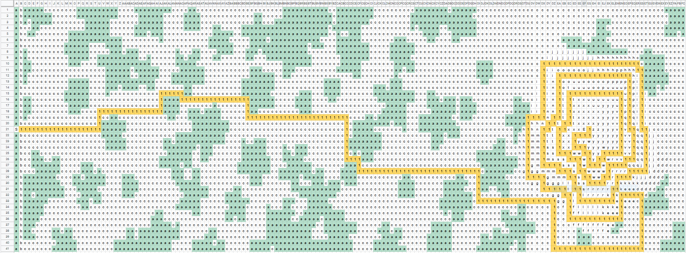
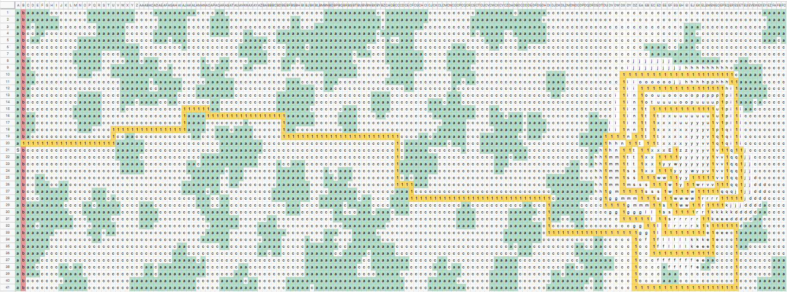

## Manual approach

* added spaces to input file using `perl -pe 's/(.)/\1 /g' input.txt >input2.txt`
* imported this file to Google Sheets
* use conditional highlighting to colorize cells with `a`
* trace path from `S` to `E` by replacing cells with `1`
* use Find to count number of `1`

### Part 1

### Part 2

